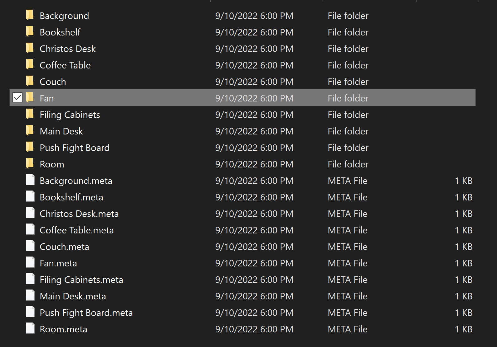
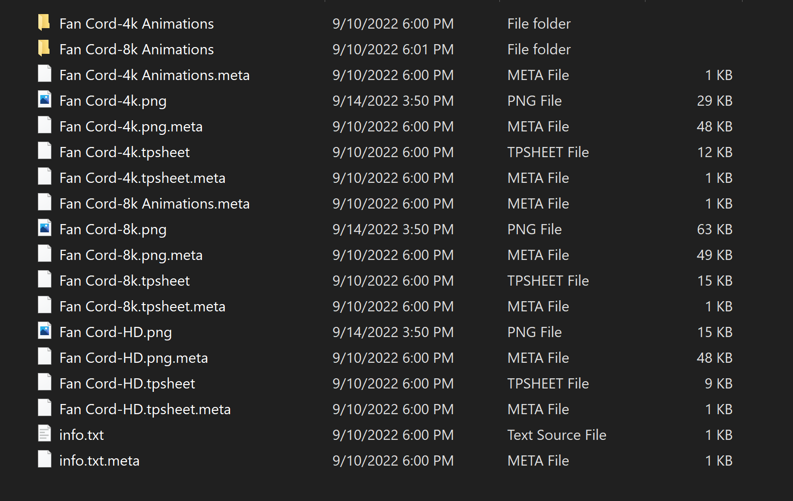
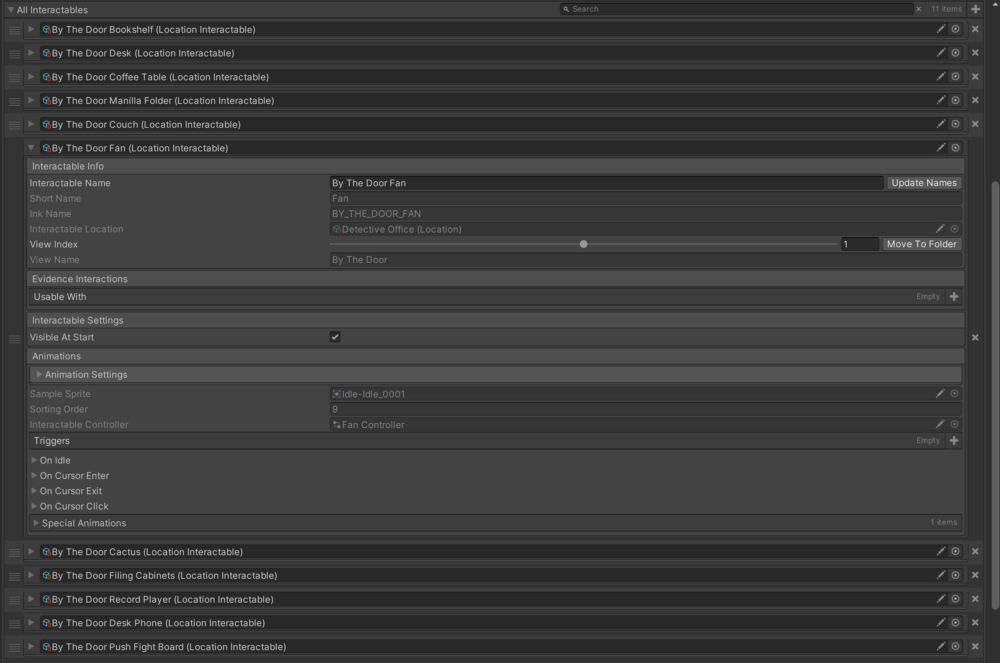
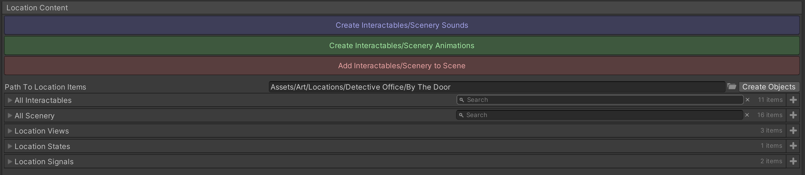
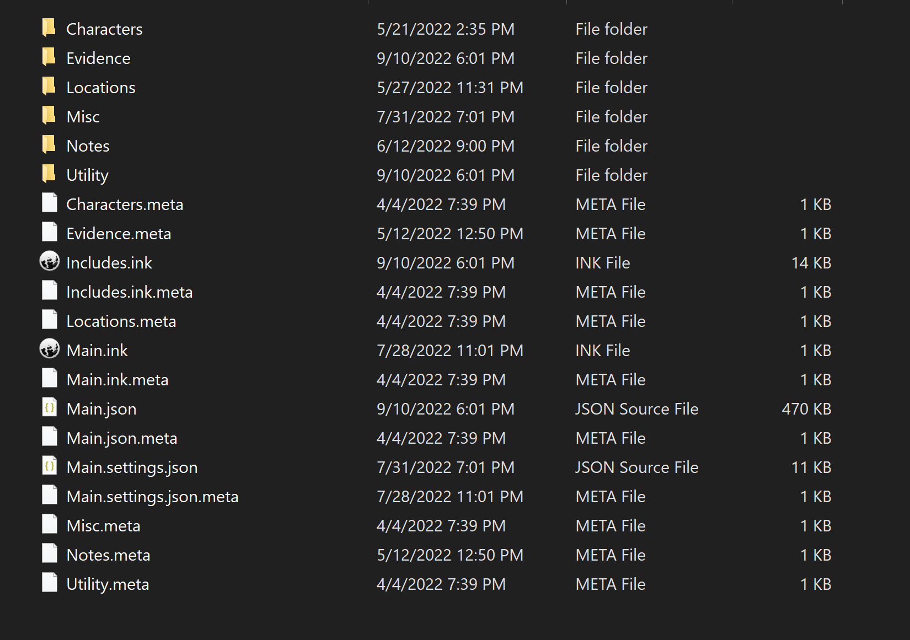
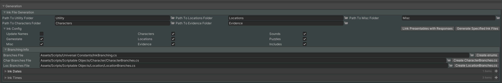

*The features shown below are part of the [Link] Detective Project, which is currently under development. As such, the demo's code/assets will remain private.*
*I am not affiliated with any of the assets linked below.*
***

## Art Pipelines in the Detective Project

The detective game features *mostly* 2D backgrounds and characters, with some 3D models as evidence. However, the game's design requires frame-by-frame animation for the backgrounds/characters, as well as being able to interact with the elements of the scene. To avoid the tedious task of adding and arranging the sprites and animations, I created a simple pipeline that automatically creates all the required objects and adds them to the correct scene.

*I am not an artist. Excuse the visuals!*

### Programs/Assets Used

- [TVPaint 11](https://www.tvpaint.com), to create the background/character art.
- [TexturePacker](https://www.codeandweb.com/texturepacker), to create spritesheets.

### Location Art Pipeline

- Two ScriptableObjects define the various elements of a "Location" or Background, LocationScenery and LocationInteractable.
	- They are similiar, except LocationInteractables also react to the player's cursor.
- In TVPaint, layer names were formatted as follows: "I"/"S"\_NAME_ANIMATION\_MISC, where:
	- "I" if the element is Interactable, "S" if it is scenery. 
	- "NAME" is the name of the location element.
	- "ANIMATION" is the animation name.
	- "MISC" can be anything, typically "LINEART" or "BLOCKIN".
- A george script (heavily based on [the script in this repo](https://github.com/PhilipBorgesen/tvpExport)) then exports each object into their own folder.
- A python script runs TexturePacker on each folder to create spritesheets of different sizes.

 is Interactable. ")
- Finally, a UnityEditor script go through each folder and creates/updates the LocationInteractable/LocationScenery ScriptableObjects.

### Character Art Pipeline

*Work in progress...*

***

## Text Pipelines in the Detective Project

When considering how to integrate the story with the game, I wanted a number of conditions satisfied:

- **No magic strings**: Character names should not be misspelt unless intentional. Tags and actions in the story text need to be properly formatted to avoid strange strings in the game. Everything constant should be in a variable. 
- *Interaction with Locations*: As described above, locations have interactable elements. Interacting with said elements can trigger a text response. How can we retrieve said text from the story file?
- *Branching*: The design of the game promotes heavy branching and non-linear storytelling. That needs to taken into account from the start. 

Knowing all this, I decided to write the story using [Ink](https://github.com/inkle/ink):

- Ink is used to write interactive fiction; branching is fully expected. 
- Ink's scripting language is flexible and easy to use!
- Ink uses text, not flowcharts or graphs. Creating new Ink files from the editor is trivial.

### Programs/Assets used.

- Ink/inky, to write the story and generate the story JSON.
- [Dialogue System](https://assetstore.unity.com/packages/tools/ai/dialogue-system-for-unity-11672), to play the story in Unity.

### Description of the Pipeline

The ink files are composed of two seperate parts:
	1. The actual story text that the player will experience. 
	2. The boilerplate ink "code" that is generated from the Unity Editor.
	
The former is obvious. The latter is a collection of all constants (Character names, Location names, Interactable names, ....), variables (Location states, Presentable states, etc.), and even functions that are generated from the Editor. 

Since the story text and boilerplate sometimes share the same file (as is the case with a Location's interactables; each interactable is a stitch, and each stitch houses the story text for that interactable), it is important to avoid overwriting the story text when generating/updating Ink files.

### Features

- Generates the following Ink Variables:
	- Character names.
	- Location names.
	- Character moods (animations).
	- Interactable names.
	- Sound/Music names.
	- Animated cutscene names.
	- Puzzle categories/puzzle names.
	- *Ink Actions*, which are special actions written in text that Unity will process.
	- *Fingerprints*, a special file listing who's fingerprints are on which evidence.
	- Essential gamestate variables. 
- Generates the following Ink stitches/knots, while maintaing previous text:
	- Interactable stitch (what is said when you click on an interactable).
	- Testimony stitch (what is said when you present something to a character).
	- Contradiction stitch (what is said when you present a contradiction to a character).
	- Evidence knots, one for each piece of evidence (in case you can interact with a piece of evidence). 
	- ... and so on.
- This repo contains some sampled generated Ink files in the "Sample Ink Files" folder.